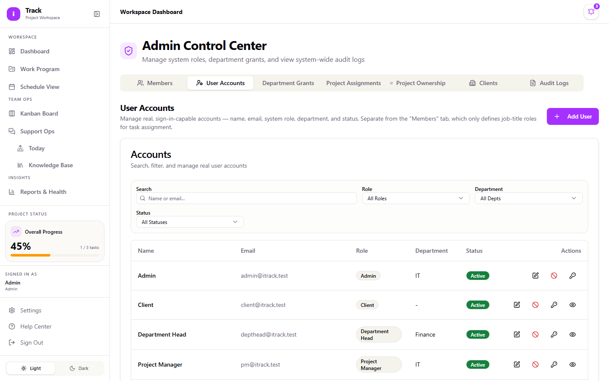
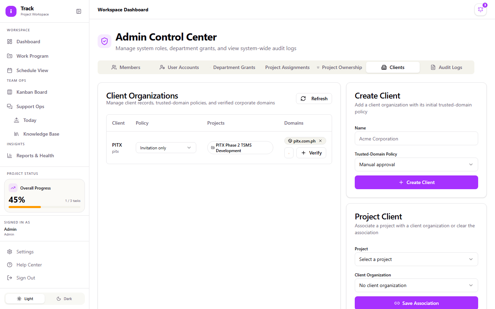
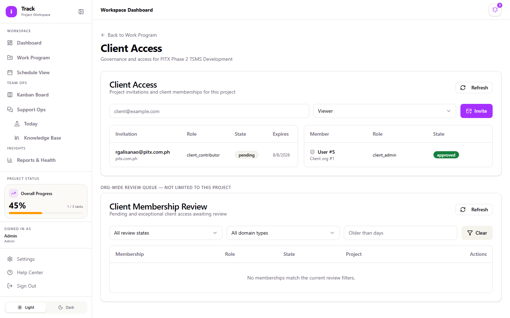
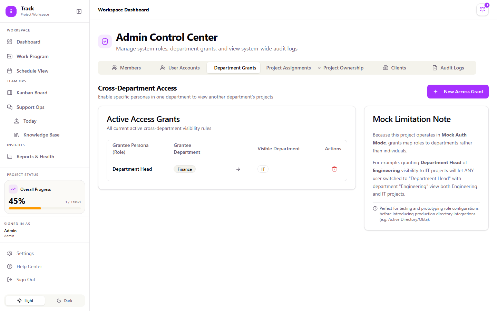
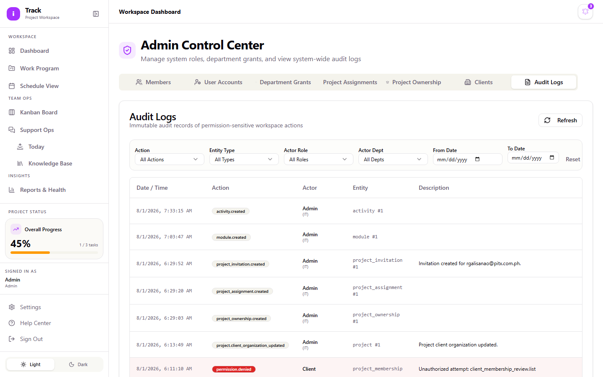

# Admin Guide

As an Admin, you have full access to iTrack. You create and manage user accounts, control which client organizations can see which projects, approve or reject client access requests, assign people to projects, and review the audit trail of who did what. Everyone else in the system depends on the accounts and access rules you set up here. If a Project Manager can't invite a client, or a new hire can't sign in, this is where you fix it.

This guide covers the tasks that are specific to the Admin role. For day-to-day work inside a project (updating tasks, using the Kanban board, working Support Ops tickets), see the [Project Manager Guide](project-manager.md) or [Team Member Guide](team-member.md). Admin accounts can do all of that too, and the steps are the same.

## Signing in

1. Go to the iTrack login page.
2. Enter your **Email** and **Password**.
3. Select **Sign in**.

If you see "Invalid credentials," double check your email and password. If you see a connection error, the API server may be down. Contact whoever manages your deployment.

## Creating and managing user accounts

User accounts are the real login credentials people use to sign in. This is different from the "Members" list in the Admin Panel, which just tracks job titles used on tasks (Vendor or Client side) and isn't a login account.

**To create a new user account:**

1. Open **Admin Panel** from the sidebar.
2. Select the **User Accounts** tab.
3. Select **Add User**.
4. Fill in **Name**, **Email**, **Password**, **Confirm Password**, **Role**, and **Department**.
5. Role must be one of: Admin, Project Manager, Department Head, Team Member, or Client.
6. Select **Add User** to save.

**To edit, disable, or reset a password for an existing account:**

1. On the **User Accounts** tab, use the **Search**, **Role**, **Department**, or **Status** filters to find the account.
2. In the **Actions** column, select the icon for what you need:
   - **Edit** — change name, email, role, or department.
   - **Disable** — the account is signed out immediately and can't sign in again until you reactivate it. You'll be asked to confirm.
   - **Reactivate** — appears in place of Disable once an account is disabled. The person can sign in again right away.
   - **Reset Password** — opens a dialog with **New Password** and **Confirm New Password** fields.

A disabled account still appears in the list with a **Disabled** status badge. It isn't deleted, so you can reactivate it later without recreating it.

## Previewing the system as another role

If you want to see exactly what a Department Head or Client sees without asking them to screen-share, use **Preview as this user**.

1. On the **User Accounts** tab, find the account.
2. Select the **Preview as this user** icon in the Actions column. (This isn't available for other Admin accounts or for disabled accounts.)
3. The app now shows navigation, buttons, and pages exactly as that user would see them.

Preview mode is read-only by design: any change you try to make while previewing (creating a task, editing a record, anything beyond viewing) is blocked. This is intentional, not a bug. If you need to make a change on someone's behalf, stop the preview first and use your own Admin account.

## Setting up client organizations and domain policies

Before a Project Manager can invite a client to a project, the project needs to be linked to a client organization, and that organization needs an access policy.

**To create a client organization:**

1. Open **Admin Panel** → **Clients** tab.
2. In the **Create Client** panel, enter the organization's name and select a policy:
   - **Manual approval** — every membership request needs an Admin or Project Manager to approve it.
   - **Verified domains auto-approve** — anyone signing up with an email from a verified domain is approved automatically.
   - **Invitation only** — only people explicitly invited can join; no self-service requests.
3. Select **Create Client**.

**To verify a domain for that organization** (needed for the auto-approve policy):

1. Still on the **Clients** tab, find the organization's row.
2. In the domain field, enter the domain (for example, `client.example`).
3. Select **Verify**.

**To link a project to the client organization:**

1. In the **Project Client** panel, select the project and the client organization.
2. Select **Save Association**.

Until a project has a linked client organization, the **Invite** button on that project's Client Access panel stays disabled. This is the most common reason a PM will tell you they "can't invite a client."

## Reviewing and approving client access requests

Client membership requests (whether someone is waiting for approval, was rejected, or needs to be suspended) go through the **Client Membership Review** queue. This queue is org-wide: it isn't limited to one project, so check it periodically rather than waiting for someone to flag it.

1. Open a project's **Work Program** page and select the **Client Access & Governance** icon near the top, or go directly to that project's Client Access page.
2. Under **Client Membership Review**, use the **Review state**, **Domain type**, or **Older than days** filters to narrow the list if it's long.
3. In the **Actions** column, the buttons available depend on the membership's current state:
   - **Pending** → **Approve**, **Reject**, or **Expire**
   - **Approved** → **Suspend** or **Remove**
   - **Suspended** → **Restore** or **Remove**

If a row shows "No actions," that membership is already in a final state (rejected, removed, or expired) and can't be changed further.

## Managing project assignments and ownership

- **Project Assignments** (Admin Panel tab): assigns a user to a project with a specific role. Select **New Assignment**, choose the **User**, **Role**, and **Project**, then select **Assign**.
- **Project Ownership** (Admin Panel tab): sets who owns a project. Select **Assign Owner** to set an owner, or select **Transfer** next to an existing owner to hand ownership to someone else.

## Granting cross-department access

By default, a Department Head only sees projects in their own department. If someone needs visibility into another department's projects without changing their role:

1. Open **Admin Panel** → **Department Grants** tab.
2. Select **New Access Grant**.
3. Fill in the **Grantee Persona Role**, the requesting department, and the **Target Department to Reveal**.
4. Select **Create Grant**.

## Reviewing audit logs

Every permission-sensitive action in the system (access denials, status changes, project creation, and similar events) is recorded and can't be edited or deleted.

1. Open **Admin Panel** → **Audit Logs** tab.
2. Filter by **Action**, **Entity Type**, **Actor Role**, **Actor Dept**, or a date range using **From Date** / **To Date**.
3. Select **Reset** to clear filters.

Note that actions taken by an Admin while previewing another role are still logged under the Admin's real identity, not the previewed role. The audit trail always reflects who actually performed the action.

## Managing member roles and glossary terms

Two smaller admin-only lists round out setup:

- **Members** (Admin Panel tab): job-title roles used when assigning responsibility on tasks (for example, "PM" for Project Manager, on the Vendor or Client side). Select **Add Member Role** to create one; each entry has an **Abbreviation**, **Role Title**, **Stakeholder Side**, and **Responsibility Description**.
- **Team** (sidebar) and **Glossary** (sidebar): both show Add, Edit, and Delete buttons to every role, but only an Admin account can actually save changes. Everyone else gets an error if they try. If a Project Manager or Team Member asks why their edit didn't save, this is why.
