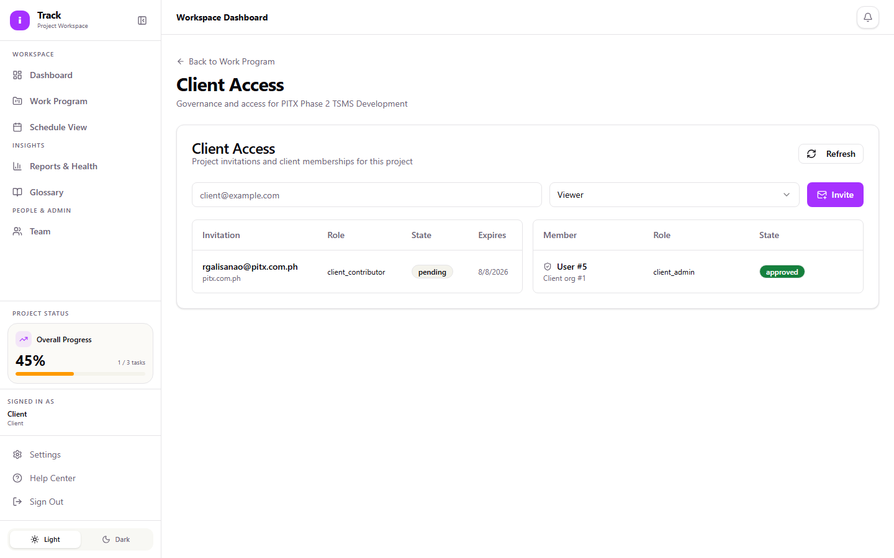

# Client Admin Guide

As a Client Admin, you're the point person on your organization's side for a specific project. In addition to viewing project progress like any other client account, you can invite other people from your organization onto that project and see the status of everyone you've invited. This guide covers that responsibility along with the viewing tasks you share with other client roles.

> **Note:** Task editing (adding or changing Work Program items) isn't available on client accounts yet, including Client Admin. You'll see the same read-only Work Program view as a Viewer or Contributor. This guide will be updated once that changes.

## Getting access

There's no self-service sign-up for a Client account. A Project Manager or Admin on the project invites you by email and assigns you the Client Admin role, and you're given login credentials directly. If you're expecting access and haven't received credentials, check with your contact on the project team.

## Signing in

1. Go to the iTrack login page.
2. Enter your **Email** and **Password**.
3. Select **Sign in**.

If you get "Invalid credentials," double check what was sent to you, and confirm you're using the right link. This isn't a self-registration page.

## Your dashboard

After signing in, you land on the **Dashboard**. It shows overall progress on the project you have access to, a status breakdown (Completed, In Progress, Not Started, Delayed), a heatmap of activity by module, and a feed of recent updates.

## Inviting other people from your organization

This is the task that sets your role apart from Viewer and Contributor.

1. Open **Work Program**, select the project, and select the **Client Access & Governance** icon near the top.
2. Under **Client Access**, enter the person's email address.
3. Choose their role: **Viewer** (read-only), **Contributor**, or **Client Admin** (same invite privileges you have).
4. Select **Invite**.

The invitation shows up in the table below with a **State**. Depending on your organization's domain and approval policy, it may need to be approved by an Admin or Project Manager on the vendor side before that person can sign in; you'll see the state change once it's approved. You can view this table any time to check who from your organization has access and what state each invitation or membership is in, but approving a pending request isn't something your account can do. That step belongs to the project's Admin or Project Manager.

One thing to expect: the **Role** and **State** columns in this table show the raw values (for example, `client_contributor` or `pending`) rather than a formatted label. That's just how the table currently displays them.

## Viewing project progress in Work Program

1. Select a project, then switch between **List** and **Gantt** view.
2. Use **Expand All** / **Collapse All** to open or close everything at once, and the **Status** filter to narrow the list (Backlog, Not Started, In Progress, For Review, Completed, Blocked, Delayed).
3. In Gantt view, you can toggle **Baseline** (planned vs. actual dates) and **Critical Path**, and use **Export PDF** to save a copy.

You only see tasks the project team has marked **Share with Client**, and you won't see the **Responsible** or **Contributor** columns. Internal staffing assignments stay hidden from client accounts.

## Checking project timing

**Schedule View** (sidebar) gives you a simpler, calendar-style view of the same activities and milestones, by month or week.

## Viewing project health

**Reports & Health** (sidebar) shows the current health status of your project along with any notes the project team has added. This is view-only for your account.

## Pages you won't see

**Kanban Board** and **Support Ops** don't appear in your sidebar. They're internal-only tools for the vendor team. If you land on one of those URLs directly, you'll see a message explaining that client accounts don't have access.

