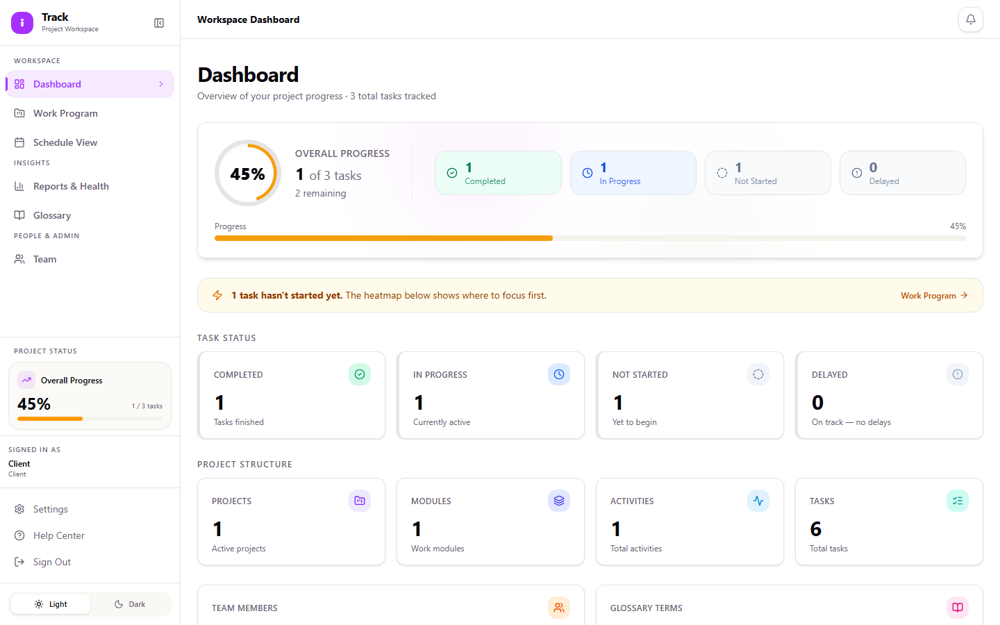
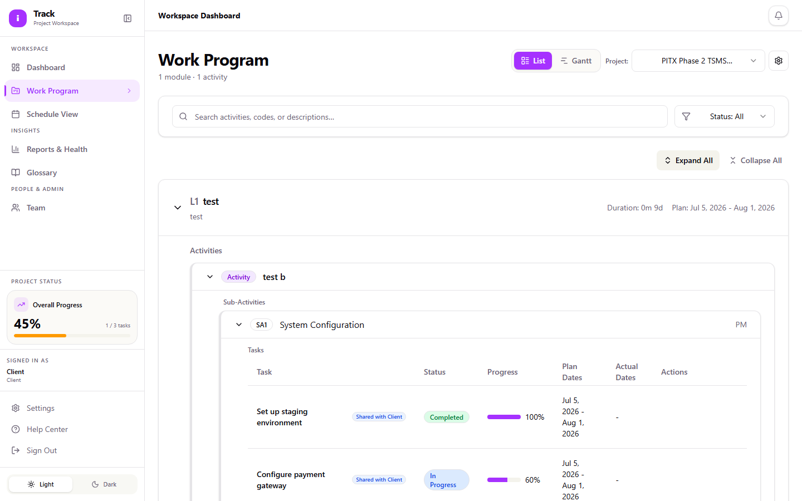
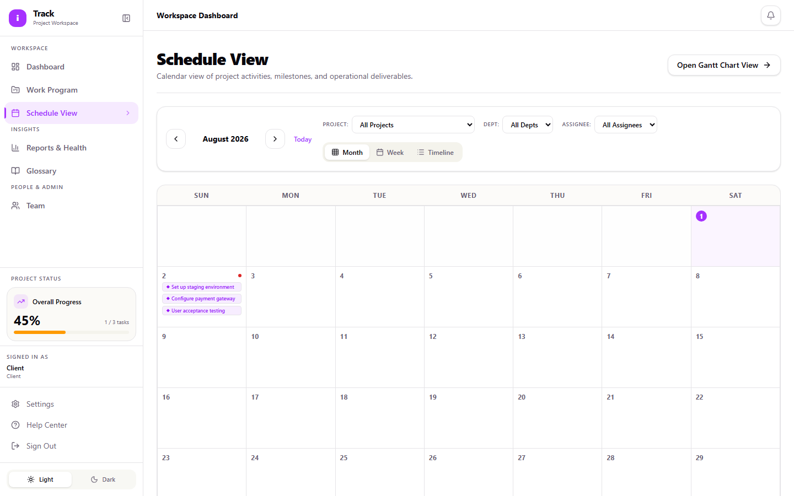
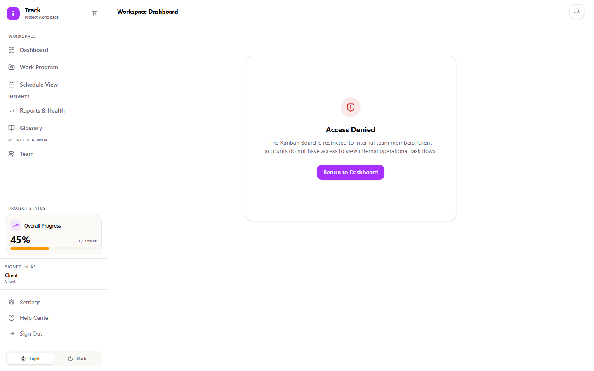

# Client Viewer Guide

As a Client Viewer, you have read-only access to the specific projects your organization has been granted access to. You can see progress, timelines, and status on anything the project team has chosen to share with you, without seeing internal-only details like who on the vendor side is assigned to what. This guide covers how to sign in and find what you need.

## Getting access

There's no self-service sign-up for a Client account. A Project Manager or Admin on the project invites you by email and assigns you the Viewer role, and you're given login credentials directly. If you're expecting access and haven't received credentials, check with your contact on the project team.

## Signing in

1. Go to the iTrack login page.
2. Enter your **Email** and **Password**.
3. Select **Sign in**.

If you get "Invalid credentials," double check what was sent to you, and confirm you're using the right link. This isn't a self-registration page.

## Your dashboard

After signing in, you land on the **Dashboard**. It shows overall progress on the projects you have access to, a status breakdown (Completed, In Progress, Not Started, Delayed), a heatmap of activity by module, and a feed of recent updates.

## Viewing project progress in Work Program

**Work Program** (sidebar) shows the project structure (**Module → Activity → Sub-Activity → Task**) for whatever's been shared with you.

1. Select a project, then switch between **List** and **Gantt** view.
2. Use **Expand All** / **Collapse All** to open or close everything at once, and the **Status** filter to narrow the list (Backlog, Not Started, In Progress, For Review, Completed, Blocked, Delayed).
3. In Gantt view, you can toggle **Baseline** (planned vs. actual dates) and **Critical Path** (which tasks are driving the end date), and use **Export PDF** to save a copy.

A few things are specific to your view:

- You only see tasks the project team has marked **Share with Client**. This is normal; if you're expecting to see something that isn't there, ask your project contact whether it's been shared yet.
- You won't see the **Responsible** or **Contributor** columns. Internal staffing assignments aren't shown to client accounts, regardless of what's been shared.
- There's no **Add Task** button or edit icons on your account. Your role is view-only; if something needs to change or looks wrong, raise it with your project contact rather than looking for an edit option.

## Checking project timing

**Schedule View** (sidebar) gives you a simpler, calendar-style view of the same activities and milestones, by month or week. It's useful if you just want to see what's coming up without opening the full Gantt chart.

## Viewing project health

**Reports & Health** (sidebar) shows the current health status of your project (on track, at risk, and so on) along with any notes the project team has added. This is view-only for your account.

## Pages you won't see

**Kanban Board** and **Support Ops** don't appear in your sidebar. They're internal-only tools for the vendor team. If you land on one of those URLs directly, you'll see a message explaining that client accounts don't have access. This is expected; there's nothing to troubleshoot.

