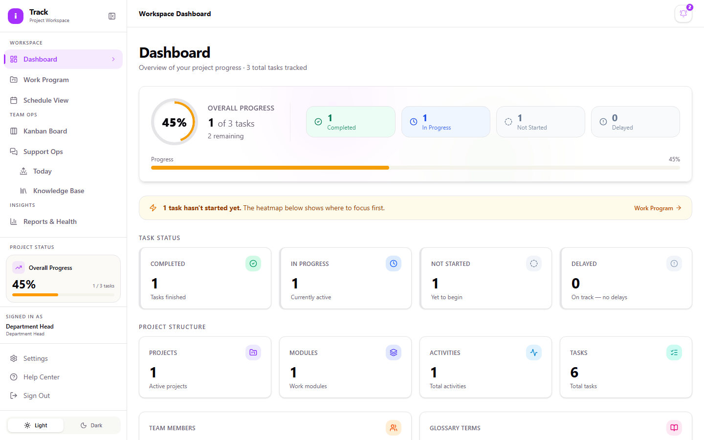
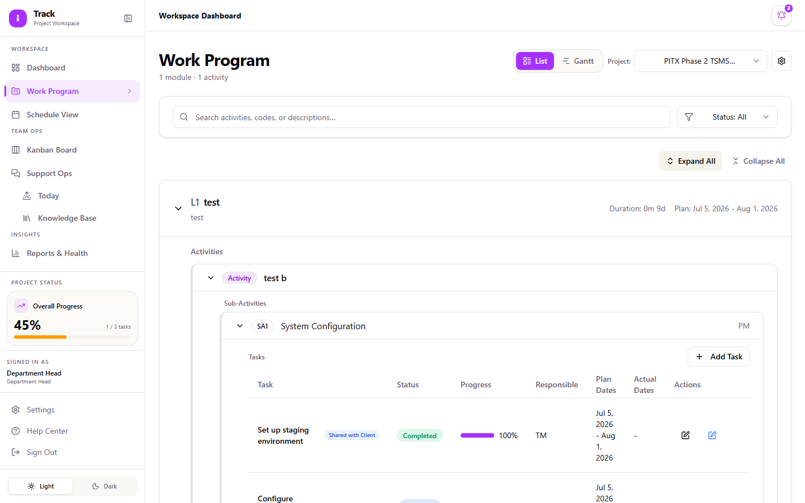
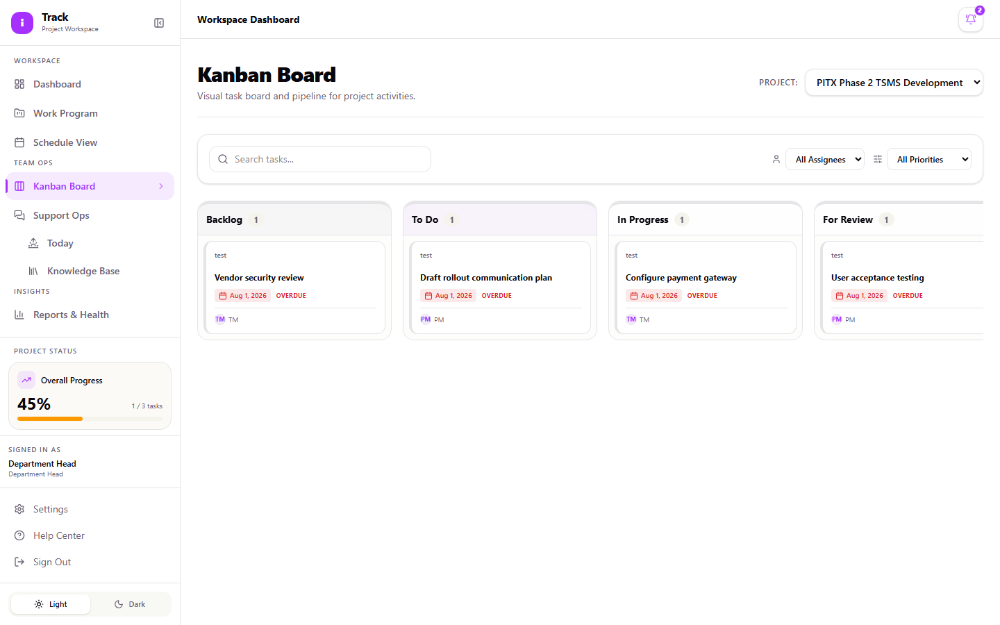

# Department Head Guide

As a Department Head, you monitor how your department's projects are progressing. You see the same dashboards, Work Program data, Kanban boards, and Support Ops activity that Project Managers and Team Members see, but your role is built for oversight and reporting, not for making changes. This guide covers how to read the information iTrack gives you and where to look when you need to check on something.

## Signing in

1. Go to the iTrack login page.
2. Enter your **Email** and **Password**.
3. Select **Sign in**.

## Reading your dashboard

Your **Dashboard** is the fastest way to see where things stand:

- The **Overall Progress** ring shows completed vs. remaining tasks.
- **Task Status** breaks work down into Completed, In Progress, Not Started, and Delayed.
- The **Task Status by Module** heatmap shows which modules need attention. Darker cells mean more tasks; select a cell to drill into that module.
- If anything is delayed, a banner at the top calls it out and links straight to Work Program.
- **Recent Activities** shows the latest task updates across all modules you have access to; use the **All / Completed / In Progress / Not Started / Delayed** tabs to filter it.

By default you see projects in your own department. If you need visibility into another department, ask an Admin to set up a cross-department grant for your role.

## Monitoring Work Program

**Work Program** (sidebar) shows the full Module → Activity → Sub-Activity → Task structure for a project.

1. Select a project, then switch between **List** and **Gantt** view depending on what you need: List for a straightforward status check, Gantt for timing and dependencies.
2. Use **Expand All** / **Collapse All** to open or close everything at once, and the **Status** filter to jump straight to, for example, everything that's **Blocked** or **Delayed**.
3. In Gantt view, toggle **Critical Path** to see which tasks are directly driving the project's end date, and **Baseline** to compare planned dates against actuals.

You'll see edit icons and an **Add Task** button on this page. Department Head accounts are read-only, so even though these controls appear, using them won't save any change. Treat them as visual noise, and use Work Program to read status, not update it. If something needs to change, flag it to the project's Project Manager.

## Checking the Kanban board

**Kanban Board** (sidebar) gives you a visual, per-status view of a project's tasks: **Backlog, To Do, In Progress, For Review, Blocked / Delayed, Done**. Select a project from the **Project:** dropdown, and use **Search tasks...** or the assignee/priority filters to narrow what you're looking at.

As with Work Program, cards can technically be dragged between columns from your account, but Department Head changes aren't meant to persist. Use this board to see where work stands, not to move it.

## Following Support Ops

**Support Ops** (sidebar) tracks client-facing issues separately from general project work. As a Department Head you can see the full board (columns run **Intake → Needs Info / Needs Investigation → Investigating → Client Update Due → Resolved**), along with two supporting views:

- **Today** rolls up what's urgent right now: stale tickets, P1s, tickets waiting on a client response, and learning priorities, across every project you can access.
- **Knowledge Base** lets you search past resolved issues by client, tenant, symptom, root cause, or resolution.

## Reviewing project health

**Reports & Health** (sidebar) shows each project's current health status and notes. You can view this for any project you have access to, but only Admins and Project Managers can change a project's health indicator. If a status looks stale or wrong, raise it with the project's PM rather than trying to edit it directly.
