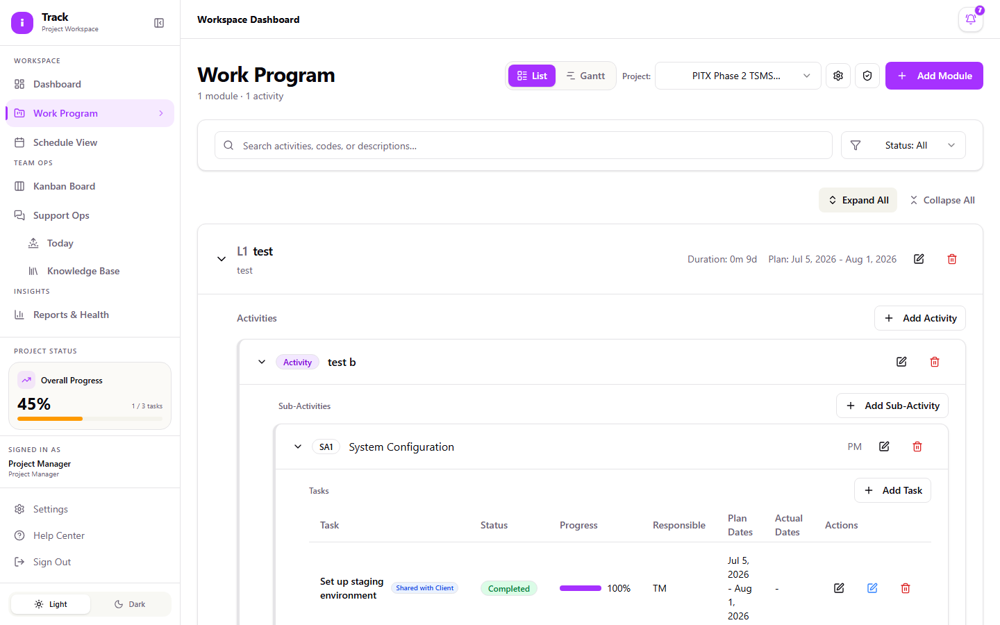
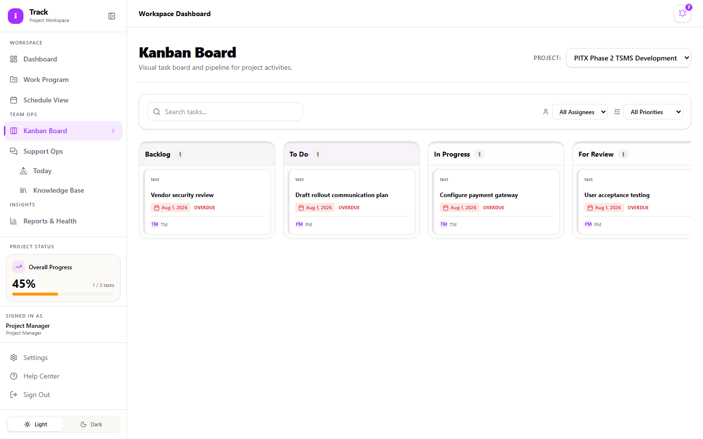
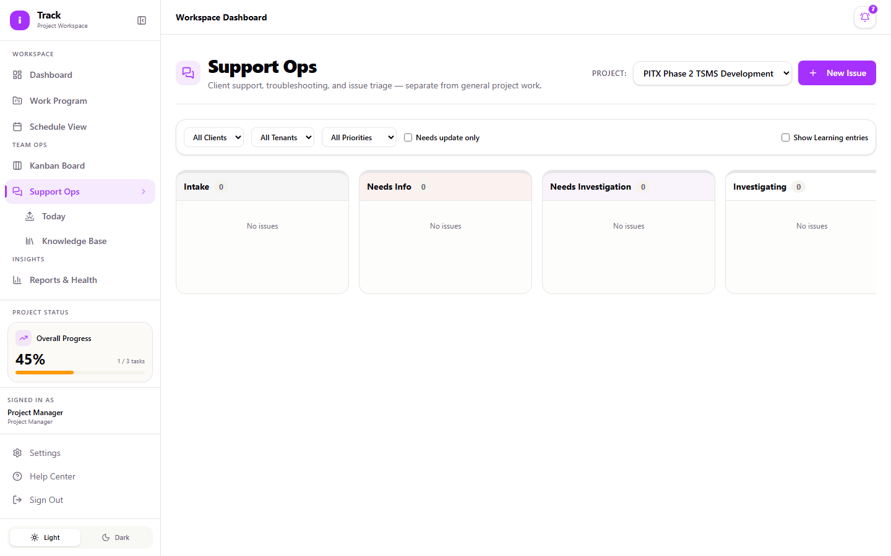

# Project Manager Guide

As a Project Manager, you build out the Work Program for your projects, keep task status current, track progress on the Kanban board, and control who from a client organization gets access to a project. This guide walks through the tasks you'll do most: setting up the project structure, managing tasks day to day, inviting and approving clients, and updating project health.

## Signing in

1. Go to the iTrack login page.
2. Enter your **Email** and **Password**.
3. Select **Sign in**.

## Your dashboard

After signing in, you land on the **Dashboard**. It shows your overall progress across projects, a breakdown of task status (Completed, In Progress, Not Started, Delayed), a "Task Status by Module" heatmap, and a feed of recent activity. If a project has delayed tasks, a banner at the top points you to them. Select it to jump straight to the affected module in Work Program.

## Setting up a project's Work Program structure

Work Program is organized in four levels: **Module → Activity → Sub-Activity → Task**. You need to create a project (or have one assigned to you) before you can add any of these.

**To create or edit a project:**

1. Open **Work Program** from the sidebar.
2. Select the **Manage Projects** icon near the top.
3. Fill in **Project Name**, **Location**, and **Last Update Date**, then save.

**To build out the structure:**

1. With a project selected, select **Add Module** and give it a name and code.
2. Inside a module, select **Add Activity**, then **Add Sub-Activity** under that activity.
3. Inside a sub-activity, select **Add Task**.
4. Each level has its own fields; at minimum, **Code**, **Name**, **Responsible**, **Planned Start Date**, and **Planned End Date**.

You're the only role, along with Admin, who can create or delete Activities and Sub-Activities, and delete Tasks. Team Members can add and edit Tasks but can't touch the levels above them. If a Team Member says they can't create a new Sub-Activity, that's expected, not a bug.

**A note on Duration:** you no longer type in a duration. Set **Planned Start Date** and **Planned End Date**, and iTrack calculates **Duration (Months)** / **Duration (Days)** for you. The field shows the result but you can't edit it directly. If the duration looks wrong, check the start and end dates first.

## Managing tasks day to day

1. In Work Program, switch between **List** and **Gantt** view using the toggle near the top.
2. Use **Expand All** / **Collapse All** to open or close every module at once, and the **Status** filter to narrow the list to a specific status (Backlog, Not Started, In Progress, For Review, Completed, Blocked, Delayed).
3. Select a task's edit icon to open the full edit dialog, or use the quick status icon to change just its status.
4. In the edit dialog, check **Share with Client** if you want this task visible to client accounts on this project. Once shared, internal users see a "Shared with Client" badge on that task, and the "Responsible" and "Contributor" columns stay hidden from the client's view either way. Clients never see who internally is assigned.

## Using the Gantt view

Switch to **Gantt** from the view toggle. From the Gantt toolbar you can:

- Toggle **Baseline** to compare planned vs. actual dates.
- Toggle **Critical Path** to highlight the chain of tasks that directly affects the project end date.
- Zoom in or out, or select **Fit All** to see the whole timeline at once.
- Select **Export PDF** to save the current view.

For a lighter-weight calendar view of the same data, **Schedule View** in the sidebar shows activities and milestones by month or week, with a shortcut back into the Gantt view.

## Inviting a client to a project

Before you can invite anyone, the project needs to be linked to a client organization. That's an Admin task (see the [Admin Guide](admin.md)). If the **Invite** button is greyed out, that link is missing; ask an Admin to set it up.

1. Open **Work Program**, select your project, then select the **Client Access & Governance** icon.
2. Under **Client Access**, enter the person's email.
3. Choose their role: **Viewer** (read-only), **Contributor**, or **Client Admin** (can invite and manage other client users on this one project).
4. Select **Invite**.

The invitation appears in the table below with a **State** badge. Depending on the client organization's domain policy, it may need manual approval before the person can actually sign in. See the next section.

## Reviewing client membership requests

If the client organization's policy requires manual approval, or if you need to suspend or remove someone's access, use the **Client Membership Review** queue on the same Client Access page (shown in the screenshot above, below the invite panel).

1. Filter by **Review state**, **Domain type**, or **Older than days** if the list is long.
2. In the **Actions** column:
   - **Pending** → **Approve**, **Reject**, or **Expire**
   - **Approved** → **Suspend** or **Remove**
   - **Suspended** → **Restore** or **Remove**

This queue is org-wide: it shows requests across every project you manage, not just the one you navigated from.

## Using the Kanban board

1. Open **Kanban Board** from the sidebar and select a project from the **Project:** dropdown.
2. Cards are grouped by status: **Backlog**, **To Do**, **In Progress**, **For Review**, **Blocked / Delayed**, **Done**.
3. Drag a card to a new column to change its status, or select it to open the full task detail.
4. Use **Search tasks...**, **All Assignees**, or **All Priorities** to filter the board.

If a project has no tasks yet, the board will tell you to add them in Work Program first. Kanban shows existing tasks; it doesn't create new ones.

## Working Support Ops tickets

**Support Ops** (sidebar) is for client-facing issues and troubleshooting, kept separate from general project tasks.

1. Select **New Issue** to open the intake form. Required fields are marked with `*`: **Issue title**, **Client**, and **Priority** (P1 = update within 1 hour, P2 = within 4 hours, P3 = within 1 business day).
2. Fill in the rest as you know it (**Tenant**, **Channel**, **Area or workflow affected**, **Expected behavior**, **Actual behavior**, **Evidence**, **Next action**), then select **Create Issue**.
3. Cards move across columns as the issue progresses: **Intake → Needs Info / Needs Investigation → Investigating → Client Update Due → Resolved**.
4. Check **Needs update only** to filter down to tickets waiting on you.

Two related pages help you stay ahead of the queue:

- **Today** (under Support Ops) rolls up everything urgent across all your projects: stale tickets, P1s, tickets waiting on the client, and learning priorities.
- **Knowledge Base** (under Support Ops) lets you search past resolved issues by client, tenant, symptom, root cause, or resolution. Check here before starting from scratch on a familiar-looking problem.

## Updating project health

On the **Reports & Health** page (sidebar), you and Admins are the only roles who can update a project's health status. Everyone else can view it but not change it.

1. Open **Reports & Health**.
2. Find the project and update its health indicator and note as needed.
