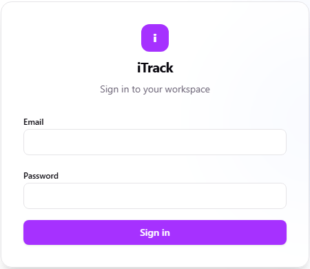
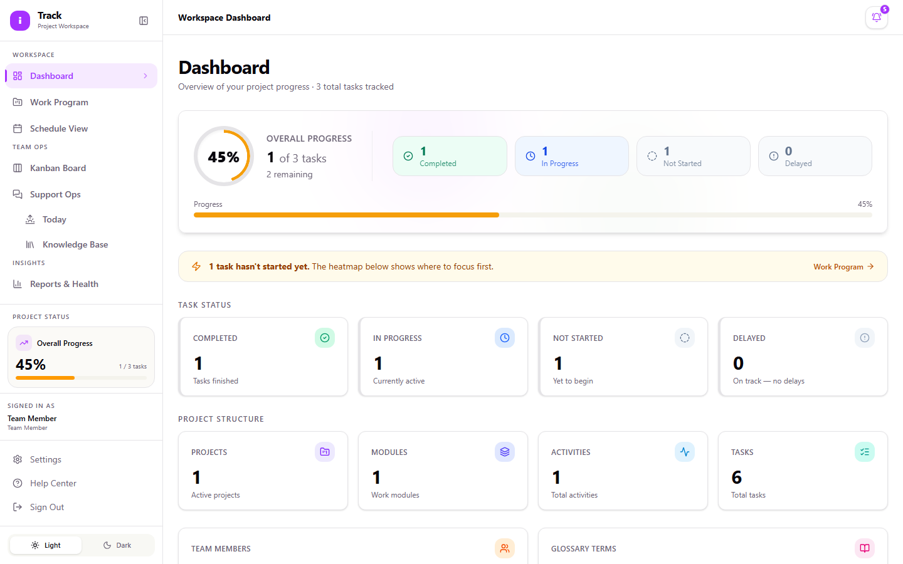
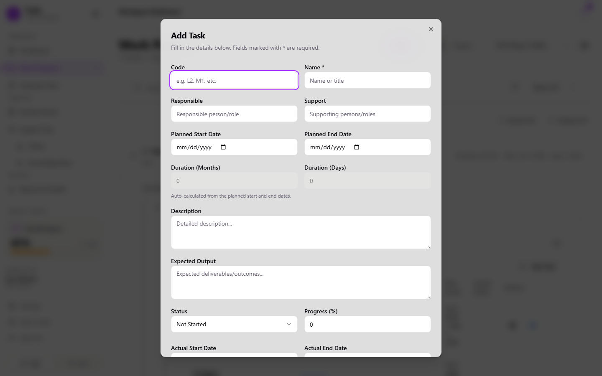
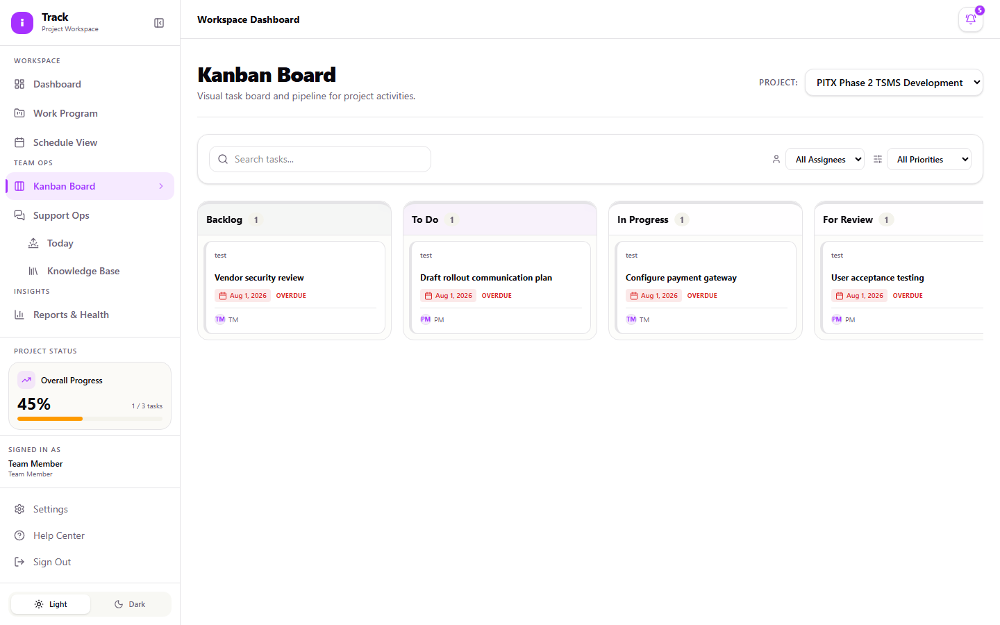
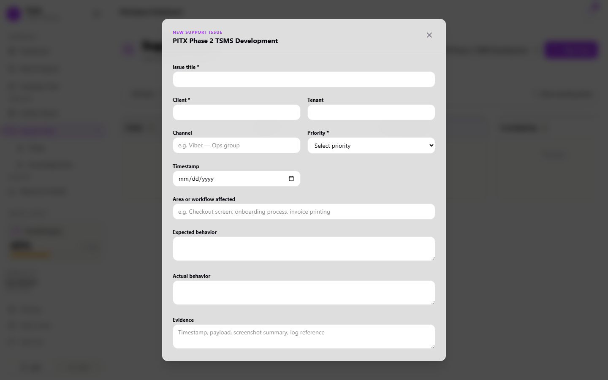

# Team Member Guide

As a Team Member, you do the hands-on work: adding tasks under existing sub-activities, updating their status as you make progress, moving cards on the Kanban board, and handling Support Ops tickets. This guide covers the tasks you'll use day to day.

## Signing in

1. Go to the iTrack login page.
2. Enter your **Email** and **Password**.
3. Select **Sign in**.

## Your dashboard

After signing in, you land on the **Dashboard**, which shows overall progress, a task status breakdown (Completed, In Progress, Not Started, Delayed), a heatmap of which modules have the most outstanding work, and a feed of recent activity. If something is delayed, a banner links you straight to it in Work Program.

## Adding and updating tasks in Work Program

Work Program is organized as **Module → Activity → Sub-Activity → Task**. You work at the Task level; the Module, Activity, and Sub-Activity structure is set up by a Project Manager or Admin.

**To add a task:**

1. Open **Work Program**, select the project, and expand down to the sub-activity you're adding work under.
2. Select **Add Task**.
3. Fill in the fields: **Code**, **Name**, **Responsible**, **Planned Start Date**, **Planned End Date**, **Description**, and so on.
4. **Duration (Months)** and **Duration (Days)** fill in automatically once you set the start and end dates. You don't enter these yourself.

**To update a task's status or details:**

1. Find the task in the list, or use the **Status** filter to jump to, for example, everything **In Progress**.
2. Select the quick status icon to change just the status, or the edit icon to open the full form (progress percentage, actual dates, notes).

You can add and edit tasks, but you can't create or delete Activities or Sub-Activities, and you can't delete a Task once it's created. Those actions are limited to Project Managers and Admins. If you need a task removed or a new sub-activity added, ask your PM.

## Using the Kanban board

**Kanban Board** (sidebar) is often the fastest way to work through your task list.

1. Select a project from the **Project:** dropdown.
2. Cards are grouped by status: **Backlog, To Do, In Progress, For Review, Blocked / Delayed, Done**.
3. Drag a card into a new column to update its status, or select the card to open full task details and edit them there.
4. Use **Search tasks...** or the assignee/priority filters to find your own work quickly.

## Working Support Ops tickets

**Support Ops** (sidebar) handles client-facing issues, kept separate from your regular Work Program tasks.

1. Select **New Issue** and fill in the intake form. Required fields (marked `*`) are **Issue title**, **Client**, and **Priority** (P1 = update within 1 hour, P2 = within 4 hours, P3 = within 1 business day).
2. Add whatever else you know (**Area or workflow affected**, **Expected behavior**, **Actual behavior**, **Evidence**, **Next action**), then select **Create Issue**.
3. As you work a ticket, move it across the columns: **Intake → Needs Info / Needs Investigation → Investigating → Client Update Due → Resolved**.

Two supporting pages help here:

- **Today** (under Support Ops) shows what's urgent right now: stale tickets, P1s, and tickets waiting on the client, across every project you have access to.
- **Knowledge Base** (under Support Ops) lets you search past resolved issues before you start troubleshooting from scratch. Search by client, tenant, symptom, root cause, or resolution.

## Checking project timing

**Schedule View** (sidebar) shows a calendar view of activities and milestones by month or week, useful for a quick "what's due this week" check without opening the full Gantt chart. Select **Open Gantt Chart View** if you need the full timeline with dependencies.
